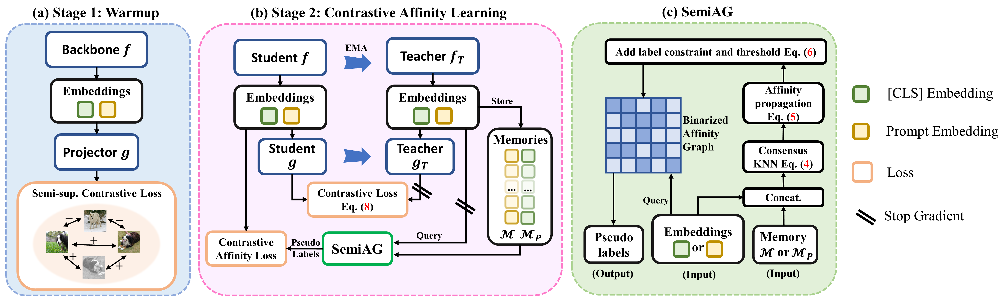

# PromptCAL for Generalized Novel Category Discovery

This repo contains codes for our paper: [PromptCAL: Contrastive Affinity Learning via Auxiliary Prompts for Generalized Novel Category Discovery](https://arxiv.org/abs/2212.05590)

> **Abstract:**
>
> Although existing semi-supervised learning models achieve remarkable success in learning with unannotated in-distribution data, they mostly fail to learn on unlabeled data sampled from novel semantic classes due to their closed-set assumption. In this work, we target a pragmatic but under-explored Generalized Novel Category Discovery (GNCD) setting. The GNCD setting aims to categorize unlabeled training data coming from known and novel classes by leveraging the information of partially labeled known classes. We propose a two-stage Contrastive Affinity Learning method with auxiliary visual Prompts, dubbed PromptCAL, to address this challenging problem. Our approach discovers reliable pairwise sample affinities to learn better semantic clustering of both known and novel classes for the class token and visual prompts. First, we propose a discriminative prompt regularization loss to reinforce semantic discriminativeness of prompt-adapted pre-trained vision transformer for refined affinity relationships. Besides, we propose a contrastive affinity learning stage to calibrate semantic representations based on our iterative semi-supervised affinity graph generation method for semantically-enhanced prompt supervision. Extensive experimental evaluation demonstrates that our PromptCAL method is more effective in discovering novel classes even with limited annotations and surpasses the current state-of-the-art on generic and fine-grained benchmarks (with nearly 11% gain on CUB-200, and 9% on ImageNet-100) on overall accuracy.




## :bookmark:Contents

1. Description
2. Dependencies and datasets
3. Running
   1. GNCD training
   2. Inductive GNCD training
   3. evaluation
   4. checkpoints
4. Acknowledgement
5. Citation

## Descriptions

This is the official PyTorch implementation of "PromptCAL: Contrastive Affinity Learning via Auxiliary Prompts for Generalized Novel Category Discovery".

## Dependencies and datasets

Our experiments are based on benchmarks including: fine-grained datasets ([CUB-200](), [StanfordCars](), [Aircraft](), [Herbarium2019](https://www.kaggle.com/c/herbarium-2019-fgvc6)), generic datasets ([CIFAR](), [ImageNet-100]()).

Note that we use the same dataset split as [GCD](https://github.com/sgvaze/generalized-category-discovery).

The dependency file of our model is `requirement.txt`

We can run `pip install -r requirement.txt`

Download datasets in your folder and change their corresponding datapaths in `/config.py`, `/data/imagenet.py`, `/data/stanford_cars.py`, `/methods/contrastive_training/common.py`.

## Running

### Preparation

Before the training, create a `/cache` folder for saving checkpoints and results.

Before the evaluation, create a `/tmp` folder for saving intermediate and evaluation results.

### Training under GNCD setting

Our model is run on a single A6000 GPU (48GB); you can also use `--devices` option since we also support training on multiple GPUs with `nn.DataParallel`. For example, we can `--device 0 --devices '0,1,2,3'` for training on four GPUs.

Training script: `bash_scripts/train_stage_1.sh` for 1st stage and `bash_scripts/train_stage_2.sh` for 2nd stage. Configurations for each datasets are separately listed in these two files.

Example annotated bash commands for training are listed as follows:

```bash
### stage 1 training for fine-grained dataset
...
python -m methods.contrastive_training.contrastive_training_1 \
            --device 'cuda:3' \
          # --devices '0,1' \ # if use cuda:0 and cuda:1 for data parallelism, --device must be 'cuda:0'
            --exp_id $EXP_ID \ # experiment id
            --lr 0.1 \
            --epochs 200 \
            --dataset_name ${DATASET} \ # dataset
            --prop_train_labels 0.5 \ # labeling ratio for known classes
            --use_val 'False' \ # false for GNCD setting
            --kmeans_interval -1 \ # fast kmeans evaluation interval, -1 means every epoch
            --eval_interval 1 \ # kmeans evaluation interval
            --use_fast_kmeans 'True' \ # fast kmeans is GPU-side KMeans
            --inkd_T 5 \ # ImageNet Knowledge Distillation (INKD) loss epoch
            --w_inkd_loss 0.5 \ # INKD loss initial weight
            --w_inkd_loss_min 0.01 \ # INKD loss minimum decayed weight
            --num_dpr 2 \ # number of supervised prompts
            --w_prompt_clu 0.35 \ # DPR loss weight
            --num_prompts 5 \ # total prompt number
            --early_stop -2
...

### stage 2 training for fine-grained dataset
...
python -m methods.contrastive_training.contrastive_training_2 \
            --device 'cuda:2' \
            --epochs 100 \
            --lr 0.1 \
            --runner_name $EXP_NAME \
            --exp_id $EXP_ID \
            --eval_interval 1 \
            --eval_interval_t 10 \ # evaluation interval for teacher model
            --kmeans_interval -1 \
            --use_fast_kmeans 'True' \
            --use_val 'False' \
            --val_split 0.1 \
            --dataset_name ${dataset_name} \ # dataset
            --prop_train_labels 0.5 \
            --num_prompts 5 \
            --num_dpr 2 \
            --w_prompt_clu 0.35 \
            --knn 5 \ # neighborhood size
            --w_knn_loss 0.6 \ # CAL loss weight
            --diffusion_q 0.8 \ # affinity threshold
            --load_from_model ${HOME}/cache/log-${save_dir}-surveillance/log/${checkpoint_exp}/checkpoints/${checkpoint_model}.pt \ ### warmup backbone checkpoint
            --load_from_head ${HOME}/cache/log-${save_dir}-surveillance/log/${checkpoint_exp}/checkpoints/${checkpoint_head}.pt ### warmup CLS head checkpoint
...
```

### Training under Inductive GNCD training

Switching between GNCD and Inductive GNCD training is quite easy; we can simply set `--use_val 'True'` if we want to train in Inductive GNCD setting (Note that for both stage 1 and stage 2, the `--use_val 'True'` are set; otherwise, the class splits will be inconsistent between two stages). Another option `--val_split 0.1` means holding out 10% labeled and unlabeled training data as a small validation set.

Example annotated bash commands for 2nd stage training are listed as follows:

```bash
### stage 2 training for fine-grained dataset
...
python -m methods.contrastive_training.contrastive_training_2 \
            --device 'cuda:2' \
            --epochs 100 \
            --lr 0.1 \
            --runner_name $EXP_NAME \
            --exp_id $EXP_ID \
            --eval_interval 1 \
            --eval_interval_t 10 \
            --kmeans_interval -1 \
            --use_fast_kmeans 'True' \
            --use_val 'True' \
            --val_split 0.1 \
            --dataset_name ${dataset_name} \
            --prop_train_labels 0.5 \
            --use_vpt 'True' \
            --num_prompts 5 \
            --predict_token 'cop' \
            --num_dpr 2 \
            --w_prompt_clu 0.35 \
            --knn 5 \
            --w_knn_loss 0.6 \
            --diffusion_q 0.8 \
            --load_from_model ${HOME}/cache/log-${save_dir}-surveillance/log/${checkpoint_exp}/checkpoints/${checkpoint_model}.pt \
            --load_from_head ${HOME}/cache/log-${save_dir}-surveillance/log/${checkpoint_exp}/checkpoints/${checkpoint_head}.pt
...
```

### Evaluation

We evaluate the best checkpoints in the 2nd stage using semi-supervised Kmeans algorithm. The script is given `/bash_scripts/k_means.sh`.

```bash

HOME=<YOUR HOME PATH>
DATASET=<DATASET>
...
PARALLEL='False' # set 'True' if use data parallelism
EVAL_TEST='False' # if 'True', evaluate on test set under Inductive GNCD setting; else 'False'
...

EXP_NAME=<EXP_NAME> # experiment folder name
EXP_ID=<EXP_ID> # exp_id of the 2nd stage
DEVICE='cuda:0'

...

### ==============================================================================================


python -m methods.clustering.extract_features --dataset ${DATASET} --use_best_model ${postfix_2} \
 --warmup_model_dir ${MODEL_PATH} --transform ${TRANSFORM} \
 --num_prompts ${NUM_PROMPTS} --device ${DEVICE} \
 --with_parallel ${PARALLEL}

python -m methods.clustering.k_means --dataset ${DATASET} --semi_sup 'True' --use_ssb_splits 'True' \
 --use_best_model ${postfix_2} --max_kmeans_iter 200 --k_means_init 100 --warmup_model_exp_id ${EXP_ID} \
 --device ${DEVICE} --eval_test ${EVAL_TEST} \
 >> ${SAVE_DIR}kmeans/${EXP_ID}_logfile_.out

```

### Checkpoints

We release trained models at [checkpoints](https://drive.google.com/drive/folders/1dy4P2NHY2lnXJYSH2atAeEX9wDaFGUSL?usp=share_link).

| Setting        | Dataset      | Stage 1                                                      | Stage 2                                                      |
| -------------- | ------------ | ------------------------------------------------------------ | ------------------------------------------------------------ |
| GNCD           | CIFAR10      | [model](https://drive.google.com/drive/folders/1CA8TI8J2DAkzRIfuo2JRTzBPVcl7V__V?usp=share_link) | [model](https://drive.google.com/drive/folders/1CA8TI8J2DAkzRIfuo2JRTzBPVcl7V__V?usp=share_link) |
| GNCD           | CIFAR100     | [model](https://drive.google.com/drive/folders/1dy4P2NHY2lnXJYSH2atAeEX9wDaFGUSL?usp=share_link) | [model](https://drive.google.com/drive/folders/1dy4P2NHY2lnXJYSH2atAeEX9wDaFGUSL?usp=share_link) |
| GNCD           | ImageNet-100 | [model](https://drive.google.com/drive/folders/1RmRYEdWAERMFIjUGowzqE5rxXpS9ficP?usp=share_link) | [model](https://drive.google.com/drive/folders/1baPNDbcQ6sIlN40LP1AgkVbm8kx1nS4g?usp=share_link) |
| GNCD           | CUB-200      | [model](https://drive.google.com/drive/folders/1dy4P2NHY2lnXJYSH2atAeEX9wDaFGUSL?usp=share_link) | [model](https://drive.google.com/drive/folders/1dy4P2NHY2lnXJYSH2atAeEX9wDaFGUSL?usp=share_link) |
| GNCD           | StanfordCars | [model](https://drive.google.com/drive/folders/17mBaS4Geq3mh21RhJ8Mo5HVog_poOblE?usp=share_link) | [model](https://drive.google.com/drive/folders/17mBaS4Geq3mh21RhJ8Mo5HVog_poOblE?usp=share_link) |
| GNCD           | Aircraft     | [model](https://drive.google.com/drive/folders/1BxuSO4r8F16L9tC4p4OAWQxAweElDy7U?usp=share_link) | [model](https://drive.google.com/drive/folders/1BxuSO4r8F16L9tC4p4OAWQxAweElDy7U?usp=share_link) |
| GNCD           | Herbarium19  | [model](https://drive.google.com/drive/folders/1U_v4JCSZGKmn6X-f9Vp5iIfEM9z79WCt?usp=share_link) | [model](https://drive.google.com/drive/folders/1U_v4JCSZGKmn6X-f9Vp5iIfEM9z79WCt?usp=share_link) |
| Inductive GNCD | CIFAR100     | [model](https://drive.google.com/drive/folders/1dy4P2NHY2lnXJYSH2atAeEX9wDaFGUSL?usp=share_link) | [model](https://drive.google.com/drive/folders/1dy4P2NHY2lnXJYSH2atAeEX9wDaFGUSL?usp=share_link) |
| Inductive GNCD | CUB-200      | [model](https://drive.google.com/drive/folders/17mBaS4Geq3mh21RhJ8Mo5HVog_poOblE?usp=share_link) | [model](https://drive.google.com/drive/folders/17mBaS4Geq3mh21RhJ8Mo5HVog_poOblE?usp=share_link) |
| Inductive GNCD | ImageNet-100 | [model](https://drive.google.com/drive/folders/1baPNDbcQ6sIlN40LP1AgkVbm8kx1nS4g?usp=share_link) | [model](https://drive.google.com/drive/folders/1baPNDbcQ6sIlN40LP1AgkVbm8kx1nS4g?usp=share_link) |

## Acknowledgement

Some of our codes are borrowed from [Generalized Category Discovery](https://github.com/sgvaze/generalized-category-discovery).


## Citation

```
@article{zhang2022promptcal,
  title={PromptCAL: Contrastive Affinity Learning via Auxiliary Prompts for Generalized Novel Category Discovery},
  author={Zhang, Sheng and Khan, Salman and Shen, Zhiqiang and Naseer, Muzammal and Chen, Guangyi and Khan, Fahad},
  journal={arXiv preprint arXiv:2212.05590},
  year={2022}
}
```

